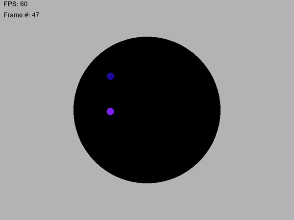

# PhysicsTest
Small test program that uses verlet integration to calculate the velocity of many balls, constrained in a large circle.

### What is verlet integration?
In short, it's a way to apply physics to an object by using their old position and new position without needing to define their velocity.

### Algorithm for each ball per frame:
1. Apply acceleration due to gravity.
2. Apply constraints
    1. If the ball is outside of the constraining circle, move it back in.
3. Resolve collisions
    1. Iterate through each ball, calculating the distances from each ball.  If the balls are within each other, move both balls apart.  
4. Update position
    1. First, calculate velocity by subtracting the current position and the old position.
    2. Save current position in old position variable.
    3. Add velocity and acceleration to current position.
    4. Reset acceleration
5. Repeat steps multiple times per frame to reduce jittering

### Demo:
</img>
